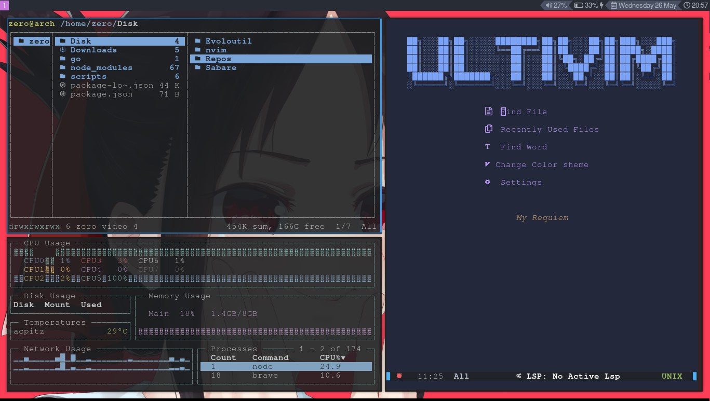

```
   ██████╗  ██████╗ ████████╗███████╗██╗██╗     ███████╗███████╗
   ██╔══██╗██╔═══██╗╚══██╔══╝██╔════╝██║██║     ██╔════╝██╔════╝
   ██║  ██║██║   ██║   ██║   █████╗  ██║██║     █████╗  ███████╗
   ██║  ██║██║   ██║   ██║   ██╔══╝  ██║██║     ██╔══╝  ╚════██║
██╗██████╔╝╚██████╔╝   ██║   ██║     ██║███████╗███████╗███████║
╚═╝╚═════╝  ╚═════╝    ╚═╝   ╚═╝     ╚═╝╚══════╝╚══════╝╚══════╝
```

> There's no place like ~/


| Program            | Name                                                           |
| :----------------- | :------------------------------------------------------------- |
| Linux Distribution | [Arch Linux](https://www.archlinux.org)                       |
| Window Manager     | [i3wm](https://i3wm.org)                                       |
| Bar                | [bumblebee-status](https://git.io/JsM0B)                       |
| Program Launcher   | [rofi](https://github.com/DaveDavenport/rofi)                  |
| Web Browser        | [Brave](https://brave.com)                                     |
| Code Editor        | [Neovim](https://github.com/UltiRequiem/UltiVim)                 |
| Terminal font      | [FiraCode Nerd Font](https://www.nerdfonts.com/font-downloads) |
| Shell              | [zsh](https://www.zsh.org/)                                    |
| Terminal Emulator  | [Alacritty](https://github.com/alacritty/alacritty)            |


You can find all my Neovim config [here](https://github.com/UltiRequiem/UltiVim)
