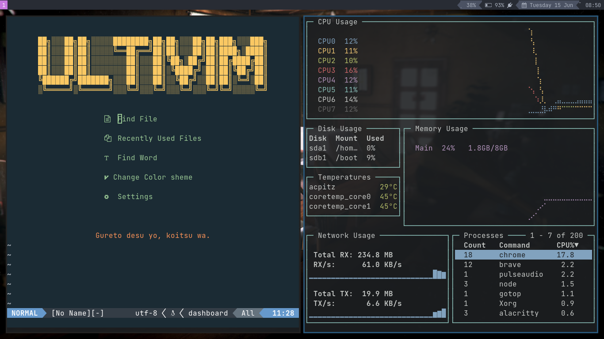

# Zero's Dotfiles

> There's no place like ~/

You can find all my Neovim config [here](https://github.com/UltiRequiem/neovim).

[Archlinux](https://github.com/UltiRequiem/Archlinux) with [i3](./.config/i3)
and [bumblebee-status](https://github.com/tobi-wan-kenobi/bumblebee-status).

## [Scripting Languages](./bin/)

- [Python](https://github.com/UltiRequiem/daily-python-practice)
- [Javascript](https://github.com/UltiRequiem/daily-js-practice)
- [Ruby](https://github.com/UltiRequiem/daily-ruby-practic)

### Mainly Dependencies

- zsh <= 5.8
- Neovim <= 6.0
- Nodejs <= 16.5.0
- Python <= 3.10
- Ruby <= 3.0
